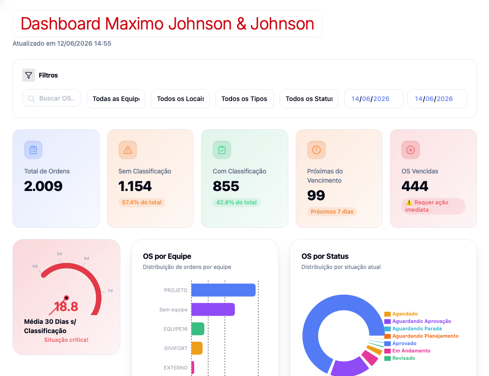

# Dashboard Maximo Kenvue

Este projeto extrai e organiza ordens de serviço (OS) do sistema IBM Maximo, permitindo uma gestão mais eficiente das equipes e do planejamento de manutenção da Johnson & Johnson.

## Funcionalidades

- Coleta automatizada de OS diretamente do IBM Maximo
- Filtros por equipamento, local, tipo, status e período
- Indicadores gerenciais: total de ordens, classificadas/não classificadas, OS vencidas, próximas 7 dias
- Distribuição de OS por equipe e por status

## Tecnologias

- Python / Power BI / Tableau
- Conexão IBM Maximo (API ou banco de dados)
